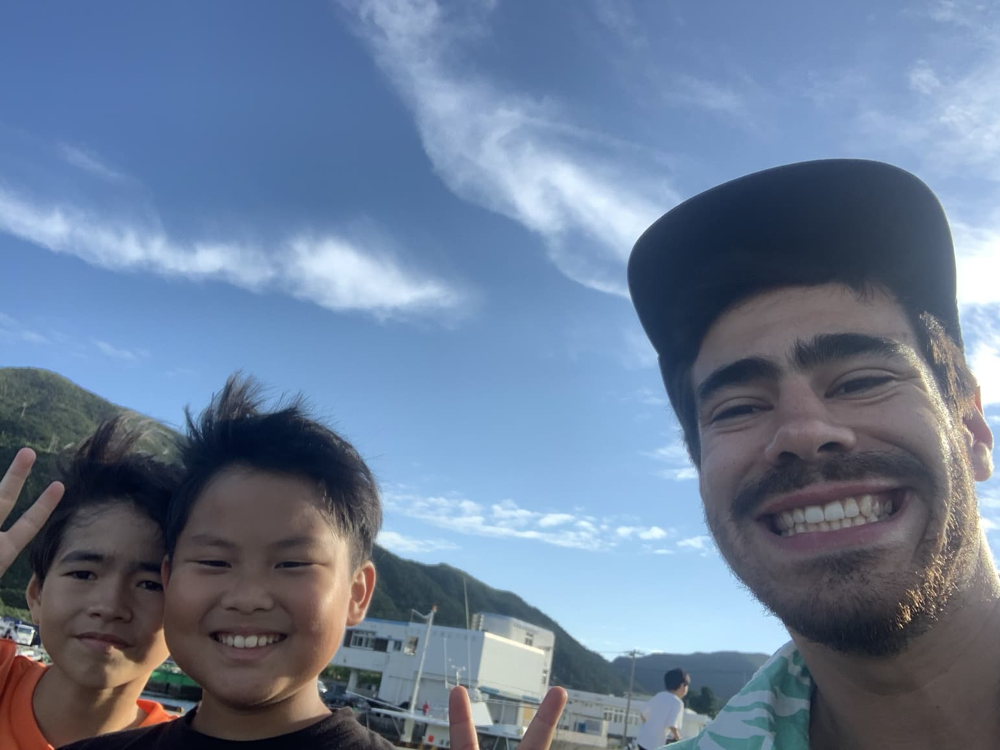
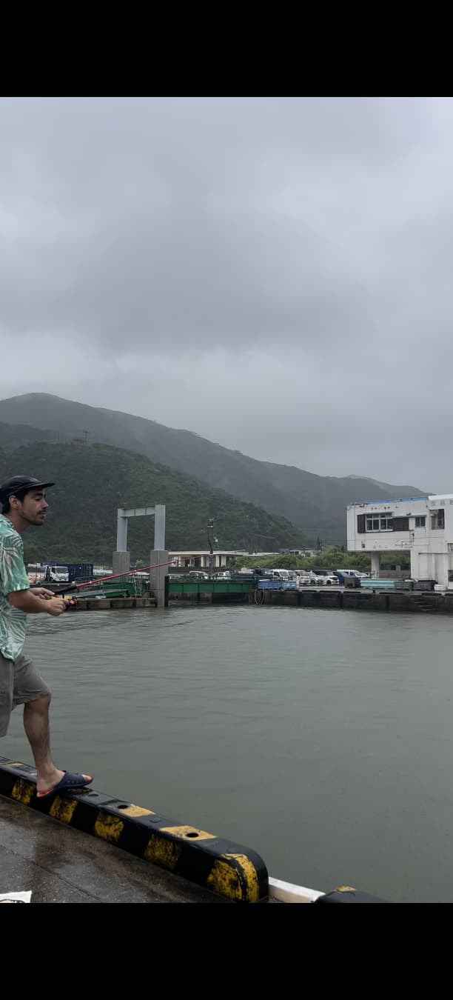
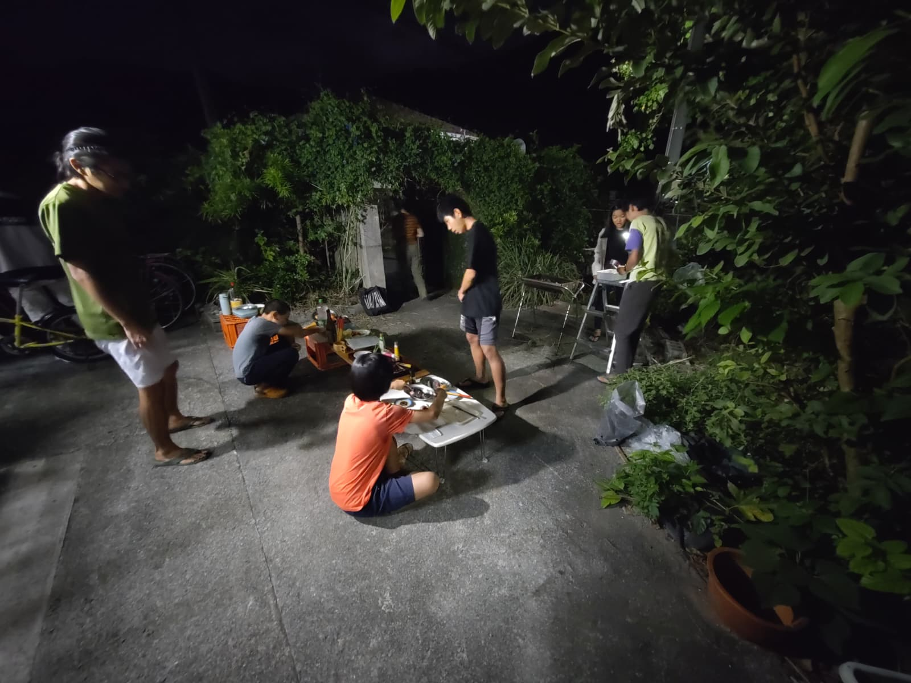
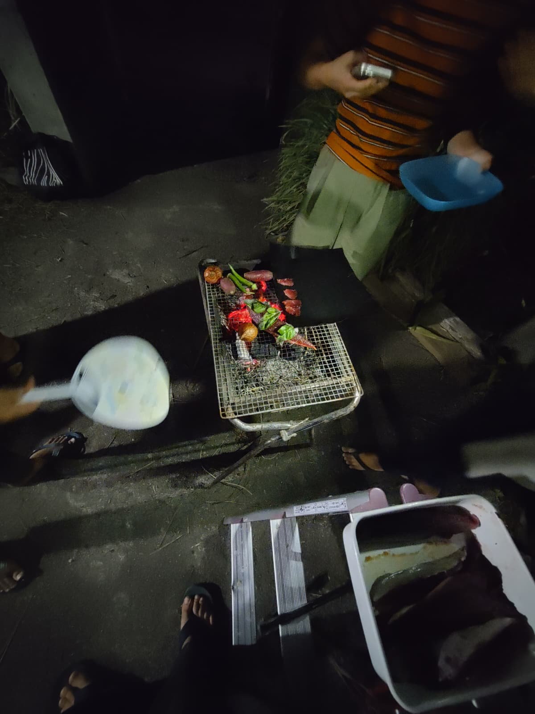
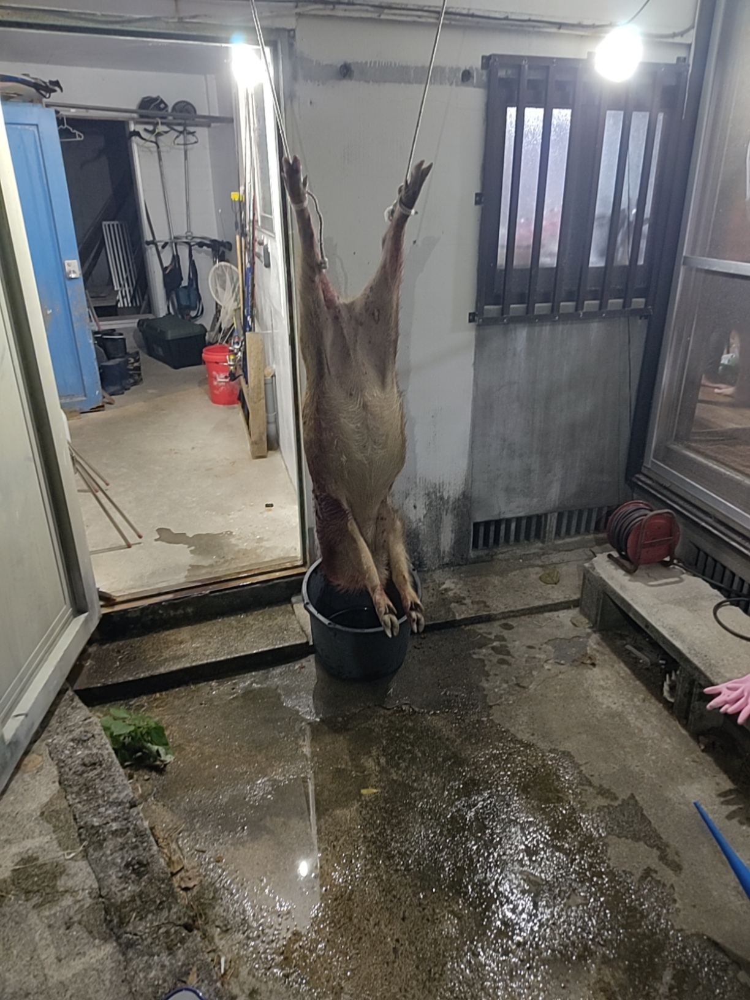

### Part I - Fishing Through the Storm

I used to see the kids every day — running, biking, fishing rods over their shoulders — rushing out after school, always heading somewhere different. I kept wondering how news of the *good* fishing spots traveled so fast between them. Some kind of island-grade, low-tech, child-powered communication network.

One afternoon, they gathered at the port. It happened to be my day off. So I jumped on my tiny pink, aggressively kawaii folding bike, grabbed my rod, and rode back to join them, pretending this was all very casual.

They were shy at first. Quick smiles, eyes darting back to their lines. A few were fooling around, but most were intensely focused, serious in that way only kids can be when something actually matters.

Then Yuma showed up. He’s Rai-san’s son. We’d already bonded over Beyblades and Pokémon at Sunny Coral, which, as far as friendships go, is a solid foundation. He walked straight up to me and explained — very carefully — how pier fishing actually works. I’d mostly fished rivers back in the Swiss mountains. This was a different world.

 

He asked me my favorite Pokémon. I wanted to say *Scyther*, but didn’t know the Japanese name, so I told a small, strategic lie.

“*Lizardon ga suki desu.*”

Charizard.

He nodded vigorously. Approval granted. Then, realizing I could understand *some* Japanese — as kids and elderly people love to do — he immediately switched to full-speed mode. A verbal flamethrower. I nodded back, just as vigorously, hoping enthusiasm could replace comprehension.

Rain started as a drizzle. No one moved. Then it turned into real rain. Still, no one moved. Finally, it became proper Okinawan rain — horizontal, loud, soaking, disrespectful.

 

Even with my Gore-Tex jacket, I was drenched, so I just gave up to the rain. Some mums came to retrieve their kids. I waved goodbye to Yuma. A small group remained, completely unbothered, rods still in the water.

That’s when Akiko-san appeared, carrying umbrellas. Not to stop them — she clearly knew better — but to make the situation survivable. She smiled at me, tall and calm, the kind of presence that makes chaos feel organized. In flawless English, she joked that I was a very motivated fisherman.

We talked in the rain. I explained I was helping at the guesthouse. She told me the kids weren’t hers — they lived at her place, Warabiya, a kind of boarding home for children from all over Japan. Tokyo, Osaka. Parents sending them here to grow up close to the sea and forest, learning by doing. I thought back to the Protestant boarding school in Fribourg I had narrowly escaped as a kid. Same concept. Very different execution.

That’s when the sign I’d seen near my house finally made sense (わらびや).

After half an hour of rain-soaked conversation, we headed home. It was my first day with the Warabiya kids. Definitely not the last.

---

### Part II — Jam and Other Escalations

Some days they came back carrying stories. Other days, proof.
Once, it was a dead *habu* snake, limp and heavy, held up like a trophy by hands still small enough to belong in classrooms. Another time, a massive moray eel, its body coiled in a bucket, teeth still looking offended. Through it all, the same thing never changed — their smiles. Calm, proud, completely unshaken, as if this was simply what afternoons were for.

That’s also how I learned Akiko-san kept chickens. Not as a hobby, but as part of the rhythm of the place. She sold eggs when she had enough, nothing more, nothing less. The eggs were incredible — deep yellow, rich, the kind that remind you food has a past before the pan. That’s also when I met her own daughters Renka and Hanaka, moving through the house with easy confidence, helping without being asked. Everyone seemed oddly competent here, not in a showy way, but in that quiet, reassuring manner that makes you realize you’re the least prepared person in the room — and somehow, that’s okay.

After a long trek, I crossed to the neighboring island and found perfectly ripe adan fruits — heavy, geometric clusters growing straight out of a tree that looks half-designed by nature, half by stubbornness. The adan (Pandanus tectorius), sometimes called screw pine, is everywhere in Okinawa: along beaches, at the edge of forests, standing firm against salt, wind, and especially ... typhoons. Its fruit looks more like an artifact than something edible — a mosaic of hard, angular segments, bright orange when ripe, stubbornly resistant to the idea of being food, like a Devil Fruit pulled straight out of One Piece — mysterious, powerful-looking, and clearly not meant to be eaten without consequences.. In brief, I obviously needed it !
You wouldn’t guess it at first glance, but with time, heat, and patience, it slowly gives in, releasing a dense, fibrous flesh with a flavor somewhere between pineapple and overripe mango — the kind of taste that feels ancient, as if it fed people long before anyone thought of supermarkets.
Since I had way too much — and baking cookies with only a Japanese fish grill is an act of pure faith — I brought some to my neighbors.

They were impressed. Curious. *Oishii desu ka?*.. It was apparently.

 

That evening, Akiko-san invited me in. I hesitated — Japan teaches you to refuse three times — but eventually accepted. The kids had caught a couple of *katsuo* (bonito fish). One was cleaning it, another slicing sashimi, another skewering for tataki. Vegetables grilled over a *shichirin* (japanese bbq grill). Everyone singing Japanese songs everyone somehow knew. Calm, coordinated chaos, conducted gently by Akiko-san.

Watching them move around the house, it slowly sank in how self-sufficient they were. Not pushed, not supervised every second, just quietly encouraged to figure things out on their own. They learned by doing — by failing, adjusting, trying again — and it showed in the way they handled knives, food, animals, even each other. There was a kind of calm self-assurance in them that felt rare, something I’d never really seen in kids that age, and it made me wonder how different growing up could feel when trust comes before control.

A young guy with long, tied-back hair came over and introduced himself with a small bow, offered me a beer. Keita-san — a staff helper, gentle and reserved, already dreaming aloud about building a place like this one someday.

The food was incredible. Sesame oil in soy sauce with sashimi chef's kiss! Shintaro, one of the oldest kids explained song lyrics to me. I introduced him to *Def Tech*. We discussed what a “yankee” was. Cultural exchange complete.

 

As the night wound down, Akiko-san approached me.

“Can I ask you a favor?”

“Mochiron.” (Of course)

She smiled and walked away.

I had no idea what I’d just agreed to...

### Part III — The Boar

A hunter had caught a wild boar in Aharen. Invasive species. They were bringing it over. They needed help butchering it.

I was not ready for that sentence..

Still, we prepared. I sharpened knives. Plastic sheets went down. Keita put the kids to bed.

Then Reiji — Akiko-san’s husband — arrived in a kei-truck that looked seconds away from tipping over from the weight.

The boar was enormous. Tusks. Head like a battering ram. We lifted it together, tied the legs, and Reiji worked quickly and precisely. Calm. Focused. Blood everywhere. No hesitation — he moved with a calm precision I’d only ever seen in a Japanese person.

We skinned it. Renka, the older daughter worked beside me — confidently, skillfully. No ceremony. Just work.

By nine pm we were deep into it, I was in charge of holding the beast while the others were cutting it into chunks and bagging them.

Reiji was completely focused, unfazed by the blood splashing across his glasses or by the raw, overpowering smell of the insides — a smell I was doing my best to endure without showing it. The stench was intense, almost unreal, but I was holding myself together.

 

At one point, he simply handed me the knife and said, “Now you do.” I froze, stiff as a stone. Then I gathered what courage I had left, grabbed the leg, studied the joints, and went at it. I couldn’t stop thinking about the *jamón serrano* I grew up with in Spain — a whole pig leg hanging quietly in the back of the kitchen. This was that memory stripped of all distance, the real thing.

It made me realize how much we separate animals from food, how far we’ve distanced ourselves from the process itself. But these people — these kids — hadn’t. They knew exactly what it meant. They didn’t flinch, and because of that, they seemed to respect the animal even more. Not a single piece was left on the bone; everything that could be eaten was used.

We eventually wrapped it up with Reiji. An *otsukaresama desu* (thank you for your hard work) and he was already gone, off to clean the blood from the boar’s head.

I went back inside. After asking how it had been, Akiko-san handed me a small plastic bag of meat as a token appreciation. I thanked them for hosting me, and for letting me be part of it, and then headed home. It was half past midnight. The moon was almost full, bright enough to follow me the whole way.

When I entered the guesthouse, I startled a few guests who were still hanging out in the kitchen having beers. Understandably so — a man covered in blood, carrying a suspicious bag, isn’t exactly reassuring. I didn’t have the energy to explain. I just shrugged, put the meat in the freezer, and headed for the shower.

I watched the blood mix with the water, spreading and thinning like ink. I thought about all those crime shows where murderers stare at the spiral of the sink as the last traces disappear. Strangely, it was beautiful. Hypnotic, even...

---

### 嵐の中の釣り

放課後になると、子どもたちを毎日のように見かけた。走り、自転車に乗り、肩には釣り竿。いつも違う場所へと急いでいく。どうして「いい釣り場」の情報が、あんなにも早く彼らの間を巡るのか、不思議でならなかった。島仕様の、低技術で、子どもたち自身が動かす通信網のようなものが、きっとあったのだろう。

ある午後、彼らは港に集まっていた。その日はたまたま私の休みだった。だから私は、やたらとピンクで、やたらとカワイイ折りたたみ自転車に飛び乗り、釣り竿を掴んで戻り、何事もなかったかのように合流した。

最初、彼らは少し恥ずかしそうだった。ちらりとした笑顔、すぐに糸へ戻る視線。ふざけている子もいたが、多くは真剣そのものだった。本当に大切なことに向き合う時の、あの子ども特有の集中の仕方で。

そこへユウマが現れた。レイさんの息子だ。サニーコーラルで、ベイブレードとポケモンを通じてすでに仲良くなっていた。それだけで友情としては十分だった。彼はまっすぐ私のところへ来て、桟橋釣りがどういうものかを、とても丁寧に説明してくれた。私はスイスの山で川釣りばかりしてきた。この海は、まったく別の世界だった。

彼は私に好きなポケモンを聞いた。私は「ストライク」と言いたかったが、日本語名が分からず、小さく、戦略的な嘘をついた。

「リザードンが好きです。」

彼は勢いよく頷いた。承認完了。すると私が少し日本語を理解できると分かった瞬間、子どもとお年寄りがよくやるように、彼は一気に全速力で話し始めた。言葉の火炎放射器だ。私は同じくらい勢いよく頷き返し、理解の代わりに熱意で乗り切ろうとした。

雨は最初、小雨だった。誰も動かなかった。やがて本降りになっても、誰も動かなかった。そしてついに、横殴りで容赦のない、沖縄らしい雨になった。

ゴアテックスのジャケットを着ていても、私は完全にずぶ濡れだった。だからもう、雨に身を任せることにした。何人かのお母さんたちが子どもを迎えに来た。ユウマに手を振った。それでも少人数の子たちは残り、まったく気にする様子もなく、竿を水に垂らし続けていた。

その時、傘を抱えたアキコさんが現れた。止めるためではない。そんなことをしても無駄だと、よく分かっていたのだ。ただ、この状況を少しでも「耐えられるもの」にするために。背が高く、落ち着いた佇まいで、混沌を整理してしまうような人だった。完璧な英語で、ずいぶん熱心な釣り人ですね、と冗談を言った。

私たちは雨の中で話した。私はゲストハウスを手伝っていることを話した。彼女は、子どもたちは自分の子ではなく、「わらびや」という家で一緒に暮らしていることを教えてくれた。東京や大阪など、全国から来た子どもたち。海と森のそばで、やってみながら学ぶために、親が送り出すのだという。私は、子どもの頃、危うく入れられそうになったフリブールのプロテスタント寄宿学校を思い出した。発想は同じ。実行はまるで違う。

その時、家の近くで見かけていた看板の意味が、ようやく腑に落ちた（わらびや）。

雨の中で三十分ほど話したあと、私たちは家路についた。それが、わらびやの子どもたちと過ごす最初の日だった。最後になるはずがなかった。

### 第二幕 ― ジャムと、その先へ

ある日は、彼らは話だけを持ち帰ってきた。別の日には、証拠を。

一度は、ぐったりとしたハブ蛇。まだ教室にいそうな小さな手で、戦利品のように掲げられていた。別の日には、巨大なウツボ。バケツの中でとぐろを巻き、歯はまだ怒っているようだった。それでも、変わらないものがあった。彼らの笑顔だ。落ち着いていて、誇らしく、まるでこれが普通の午後だと言わんばかりだった。

その頃、アキコさんが鶏を飼っていることを知った。趣味ではなく、ここでの生活の一部として。卵が十分に集まったら売る。ただそれだけ。卵は本当に素晴らしかった。濃い黄色で、豊かで、食べ物にはフライパンに入る前の「過去」があることを思い出させてくれる味だった。

その時、娘のレンカとハナカにも会った。二人とも自然体で家を行き来し、頼まれずとも手を貸していた。ここでは皆が不思議なほど有能だった。見せびらかすようなものではなく、安心させる静かな確かさ。自分が一番準備不足な人間だと気づかされる。でも、それでいいのだと思えた。

長いトレッキングの後、隣の島へ渡り、完熟したアダンの実を見つけた。自然と頑固さが半分ずつ設計したような木に、幾何学的で重たい房がぶら下がっている。アダン（タコノキ）は沖縄中にあり、浜辺や森の縁で、塩や風、そして台風にも耐えて立っている。

その実は、食べ物というより遺物のようだった。角ばった断片の集合体で、熟すと鮮やかな橙色になる。まるでワンピースの悪魔の実のように、力を秘め、簡単には食べさせてくれなさそうだった。要するに、どうしても試さずにはいられなかった。

見た目からは想像できないが、時間と熱と忍耐をかけると、繊維質で濃厚な果肉を少しずつ現す。味はパイナップルと完熟マンゴーの中間のようで、スーパーが生まれるずっと前から人を養ってきたかのような、古い味がした。

量が多すぎたのと、魚焼きグリルだけでクッキーを焼くのは信仰に近い行為だったので、私は近所にお裾分けした。

彼らは感心し、興味を示した。「おいしいですか？」どうやら、そうだったらしい。

その夜、アキコさんが家に招いてくれた。三回断るのが礼儀だと日本は教えてくれるが、結局、私は受け入れた。

子どもたちはカツオを何匹か釣ってきていた。一人が捌き、一人が刺身を切り、一人がタタキ用に串を打つ。七輪で野菜を焼き、皆が知っている日本の歌を歌う。落ち着いた、統率のとれた混沌を、アキコさんが静かに取り仕切っていた。

彼らが家の中を動き回る様子を見ているうちに、彼らがどれほど自立しているかが、じわじわと伝わってきた。押し付けられず、常に監視されることもなく、ただ自分で考えることを促されている。失敗し、調整し、また試す。その積み重ねが、包丁の扱いにも、食べ物にも、動物にも、互いへの接し方にも表れていた。

その落ち着いた自信は、同じ年頃の子どもたちでは、ほとんど見たことがないものだった。信頼が管理に先立つと、成長はこんなにも違うのかと考えさせられた。

長い髪を後ろで結んだ若い男性が、軽くお辞儀をして自己紹介し、ビールを差し出してくれた。ケイタさん。穏やかで控えめなスタッフで、いつかこんな場所を作りたいと静かに語っていた。

料理は素晴らしかった。刺身に醤油と胡麻油。完璧だ。年長のシンタロウが歌詞を説明してくれた。私はDef Techを紹介した。「ヤンキー」とは何かを語り合った。文化交流、完了。

夜も更けた頃、アキコさんが近づいてきた。

「お願いしてもいい？」

「もちろん。」

彼女は微笑んで、去っていった。

自分が何に同意したのか、その時はまだ知らなかった。

### 第三幕 ― 猪

アハレンで猟師が猪を仕留めた。外来種だ。それを運んでくる。解体を手伝ってほしい。

その一文に、私はまったく準備ができていなかった。

それでも、準備は始まった。包丁を研ぎ、ビニールシートを敷き、ケイタは子どもたちを寝かしつけた。

やがて、アキコさんの夫、レイジが軽トラックで到着した。積み荷の重さで、今にもひっくり返りそうだった。

猪は巨大だった。牙、破城槌のような頭。四人で持ち上げ、脚を縛り、レイジは静かで正確な動きで作業を進めた。血は飛び散ったが、迷いはなかった。その落ち着いた正確さは、私が見たことのある中で、日本人にしかできないものだった。

皮を剥いだ。長女のレンカが隣で作業した。自信に満ち、手慣れていた。儀式ではない。ただの仕事だ。

夜九時には佳境に入り、私は獣体を押さえる役目だった。ほかの人たちが肉を切り分け、袋に詰めていく。

レイジは完全に集中していた。眼鏡に血が飛び、内臓の強烈な匂いが漂っても動じない。その匂いに耐えるのが、私には精一杯だったが、なんとか平静を保っていた。

ある時、彼はただ包丁を渡して言った。「次は、君だ。」

私は石のように固まった。それでも残った勇気をかき集め、脚を掴み、関節を見極め、刃を入れた。スペインで育った頃、台所の奥に静かに吊るされていたハモン・セラーノの脚を思い出した。あの記憶から距離をすべて取り除いた、現実そのものだった。

それは、私たちがどれほど動物と食べ物を切り離してしまったかを思い知らされた瞬間だった。しかし、ここにいる人たち、子どもたちは違った。意味を理解していた。ひるまず、だからこそ、動物への敬意がより深かった。骨に残るものは何一つなく、食べられるものはすべて使われた。

作業はようやく終わった。「お疲れさまでした」と言い合い、レイジは猪の頭の血を洗いに行ってしまった。

私は家に戻った。様子を聞かれたあと、アキコさんが小さなビニール袋に入った肉を手渡してくれた。感謝を伝え、参加させてくれたことにも礼を言い、家路についた。

真夜中を少し回った頃だった。ほぼ満月の月が、帰り道をずっと照らしていた。

ゲストハウスに入ると、キッチンでビールを飲んでいた数人の宿泊客を驚かせてしまった。血だらけで、怪しい袋を持った男が現れたら、無理もない。説明する気力はなく、肩をすくめ、肉を冷凍庫に入れ、シャワーへ向かった。

血が水に混じり、インクのように広がって薄れていくのを見ていた。犯罪ドラマで、殺人犯が排水口の渦を見つめる場面を思い出した。不思議なことに、それは美しかった。催眠的ですらあった。