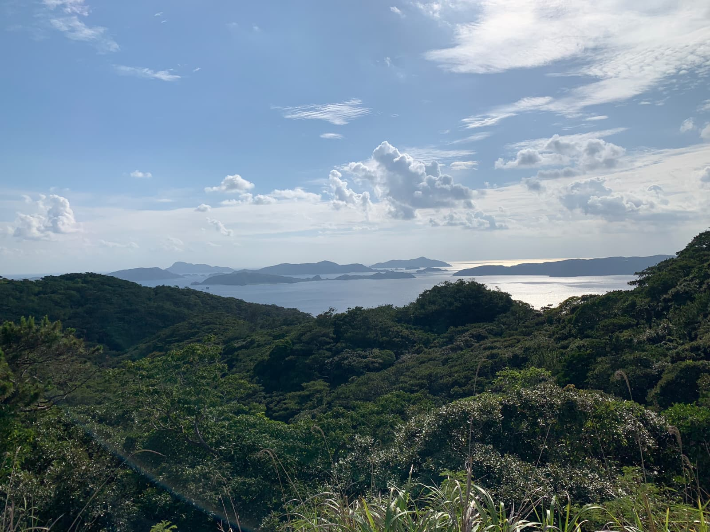
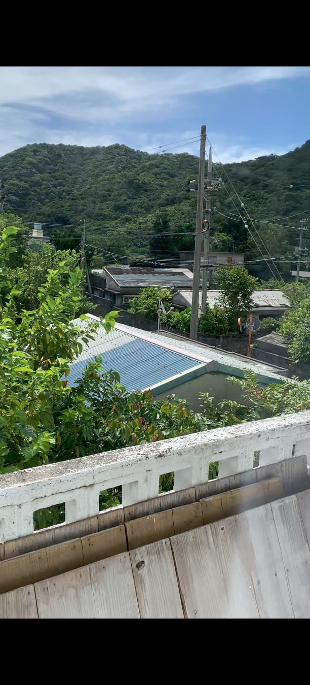
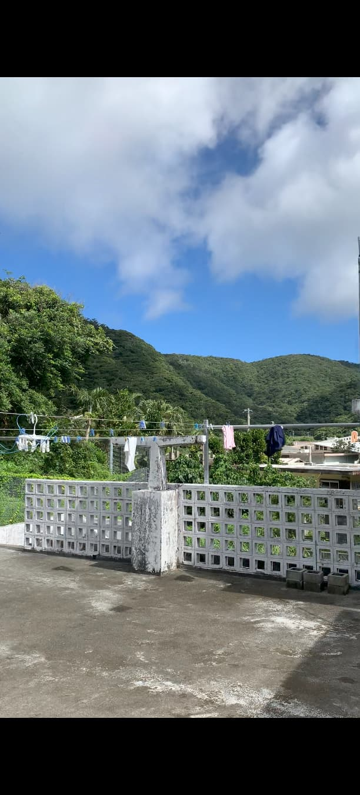

The shrill rasp of cicadas, just awakened from their long underground hibernation, is deafening. One after another they scream, weaving a shattering unison, louder than the sum of each individual clicking joined together.

 

I then let myself be gently rocked in a fabric hammock, suspended, or at least I like to believe so, not by this rope that has clearly felt the weight of passing years, but by the benevolent spirit of the _kami_ from the nearby temple.

 

A breath of sea air draws me back to observing my surroundings. I look at my aluminum container that serves as my home. I’ve learned to grow attached to it, but more than that, to the life it offers. Dew sparkles on the thin, rain-soaked _adan_. Farther away, crows peck at fallen _shikuwasa_, small sharp citrus fruits that reveal their full flavor in a glass of Okinawan awamori.

 