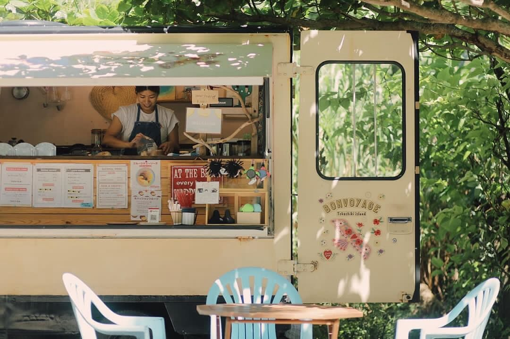
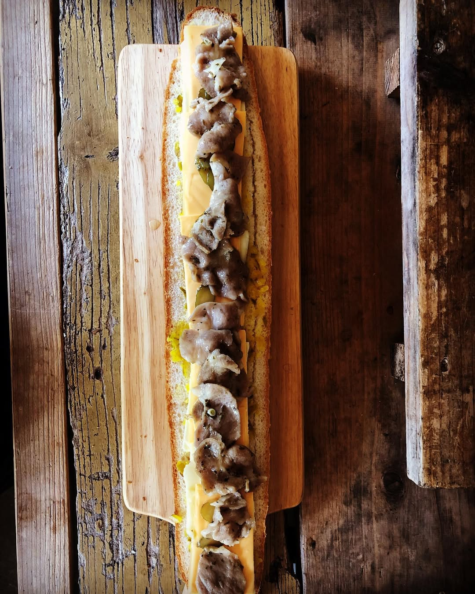

Some days, this island feels like a dream, and nothing embodies that more than Mai-san's food truck : "Bon Voyage". 

She's in her twenties tell but quite fired up, and she chose to trade the quiet predictability of Okayama for the wild freedom of Tokashiki, following a dream only she could see here. 

 

She opens when she feels like it no schedule just instinct. Maybe that's why the sides of her truck always feels like a mirage in the heat. 

Each time I walk toward the beach, I catch myself scanning the curve of the road, wondering if today is one of these lucky days if the marriage will turn out to be real this time, and if I will get the chance to order one of her legendary "Cuba sando", sandwich she presses with a kind of quiet focus that makes you stop whatever you were doing just to watch the cheese melt out of it.

 

On this tiny island, there is something magical about not knowing. And then when Mai-san's stand is open, it feels like the day itself decided to be kind..