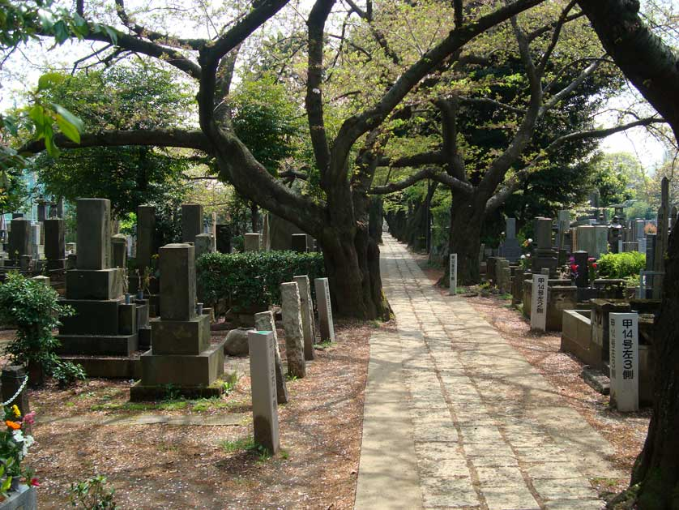
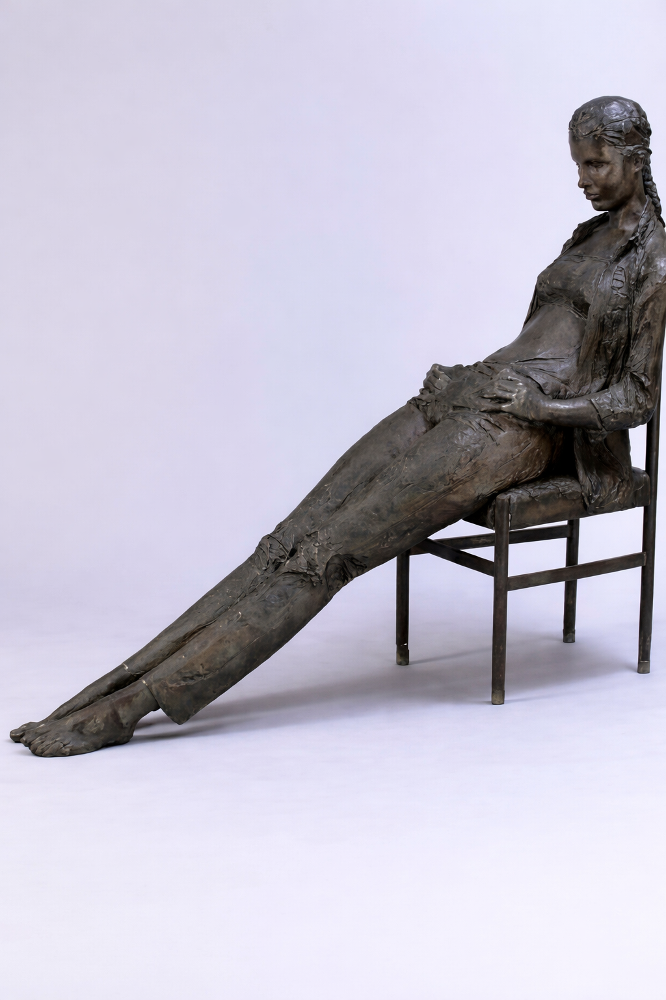
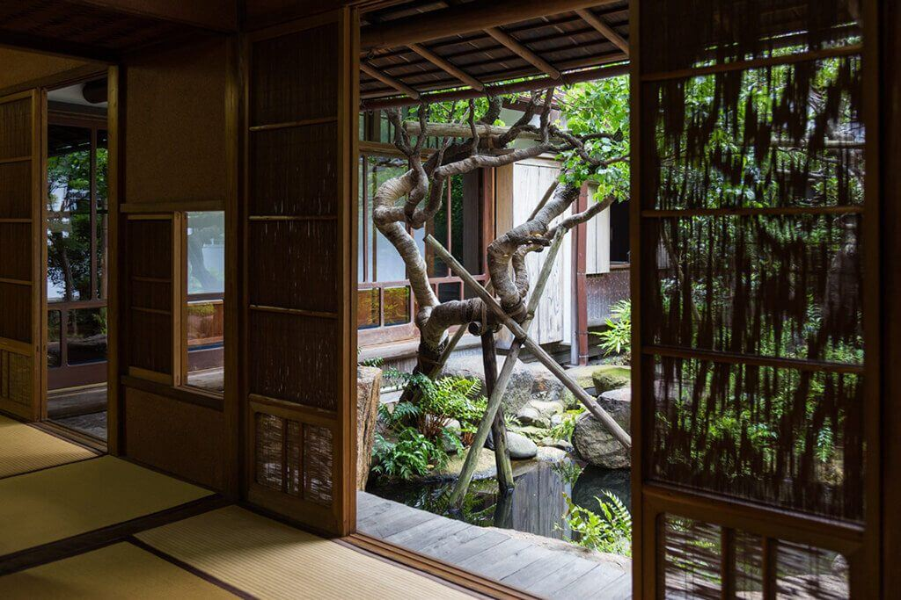
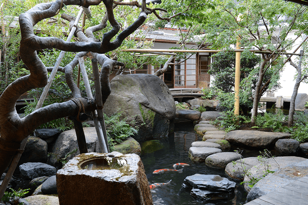

### Riding around Tokyo

I’ve been riding my bike around Tokyo for almost a week now, and it has slowly started to grow on me. I feel impossibly small in this gargantuan city, craning my neck so much I nearly hurt it just trying to catch a glimpse of the tops of the skyscrapers in Nihonbashi. Even New York never made me feel like such a tiny ant.

And yet, everything here is so orderly that it softens the scale. I can ride alongside traffic, glance around, let my eyes wander, without fearing for my life. The flow just works, silently, precisely.

Last night I spent time with Tommy, Reine’s friend, a Kampo specialist, traditional Chinese medicine. We had an acupuncture session, mysterious and oddly revitalizing. He used moxibustion, burning moxa leaves on the needles, heat traveling through places I didn’t know existed.

Then we drank a few cups of junmai sake and, as if that made perfect sense, went for an improvised night ride on skateboards, cutting through the city while heavy rain poured down around us.

### Tokyo

Clean, calm, cloudy. The city feels immense, yet controlled, overwhelmingly crowded, yet strangely safe. I watch the flow of people passing by, mesmerized, then realize I’m moving with them, riding my bike through the streets of Nihonbashi.

Everything seems to glide, footsteps, wheels, voices, lights. Nothing collides, nothing rushes. For a moment, I’m no longer navigating the city, I’m being carried by it.

A tear of pure amazement runs down my cheek, and I don’t even bother wiping it away.

.

### Yanaka

November 7th, 2025

First day in Japan. I return to my first Tokyo expedition, the Yanaka district.

 

This time, the weather is nice, and I take advantage of this gentle November sun to warm up my skin. I start upside down this time. I learned from my mistakes.

The shopping street is crowded. Having taken my omiyage fabrics, I flee into the small alleys of the district. I cross the cemetery, which used to be totally unpopulated.

 

This time, it seems to me almost austere. Crossing it, I see the Tokyo Radio Tower, which scratches the clouds. This time, I came back in the afternoon to be able to see the museums and other exhibitions.

 

I arrive at the museum of the famous sculptor Asakura. To my great surprise, I am directly informed by the guide that I have the right to a really special exhibition, because it is the 100th anniversary of his daughter, Kyoko, and that on this occasion, they paid tribute to his works. His shapes and features are smooth and simple, different from those of his father, rough and tortured.

 

I ask the guide why all the models have Western names and physiognomies, for example Brigitte, Jacquie, Hélène. The guide explains to me that this is all the depth of Kyoko's work. She, who was able to foresee the liberation of Western women in the 70s, is inspired by these ideals of beauty.

 

The house of masters is as fascinating as minimalist. What I like so much, ironically, divine for me, is grandiose. I take the time to admire each place, each piece of furniture, each tatami, when I see the Zen garden in the center of the house.

 

The guide, again behind my shoulders, gives me an anecdote. He says that there are five great stones in this garden to symbolize the five great principles of Confucius. 

""" 
Too much benevolence becomes weakness.

Too much righteousness turns into dogmatism. 

Excessive propriety becomes formalism. 

Extreme wisdom risks detached intellectualism.

Detached intellectualism, truthworthiness leads to exploitation.
""""