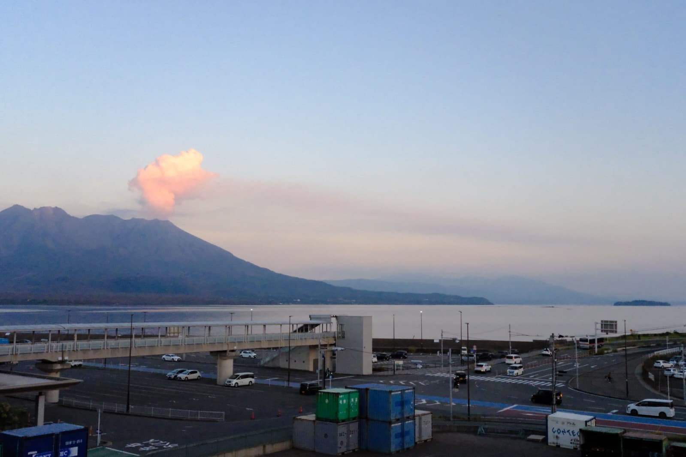
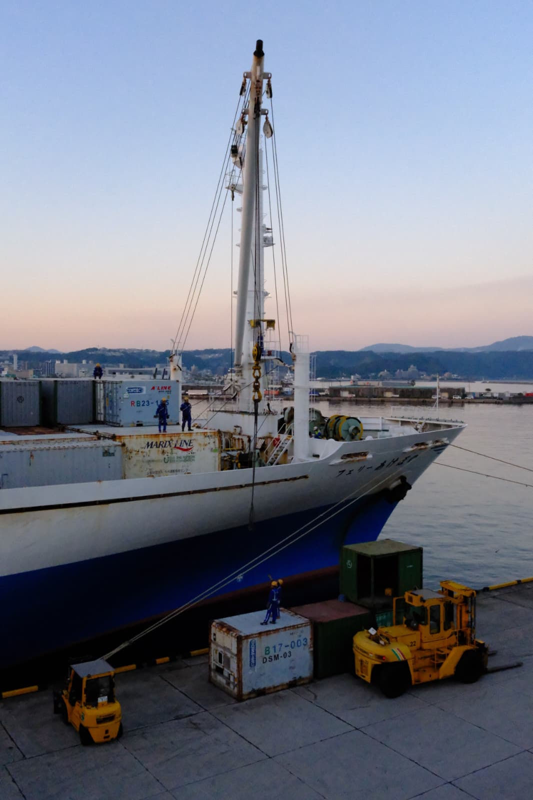

15th of November, 2025.

After seeing the sun slip behind a the Sakurajima volcano, from the Kagoshima ferry's upper deck, feels like a quiet moment, stretching through eternity. The sea is calm, the sky slowly closing. 

It's beautiful, but it also stings a little. That mix of leaving something behind and moving towards something unknown, made me think of migrants seeing their coastline fade for the last time, maybe the same light on the water, but heavy on the chest. Hope in one hand, fear on the other.

A silent promise that whatever waits across the sea is worth the risk, even if they are not sure yet.

Just a few minutes of sunset, but so many stories that have crossed that horizon.

 

 