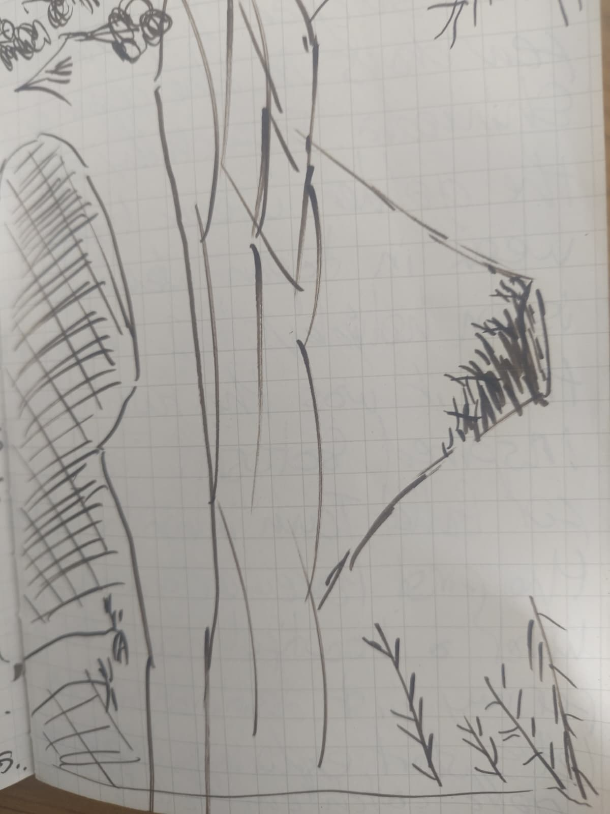
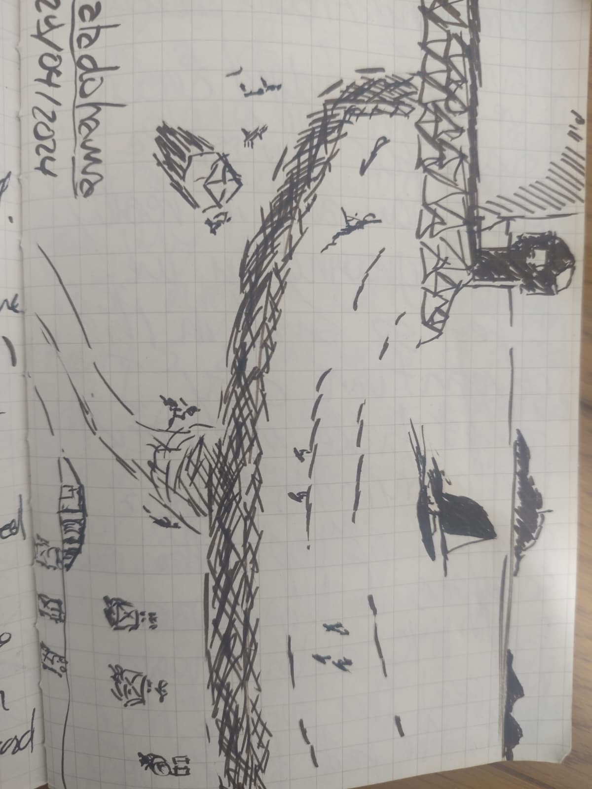
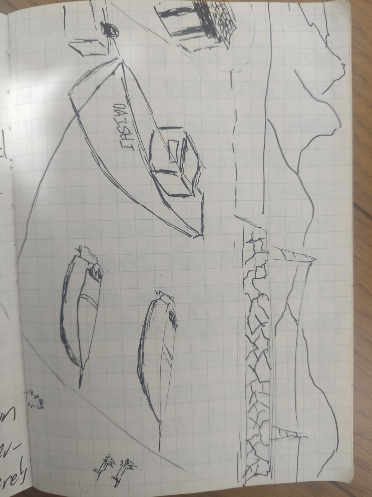

### Mount Fuji

I had been waiting for this day for so many years. And finally, today was the one.  
I spent five long days in Tokyo, watching forecasts like omens, waiting for the weather to grant permission. Now I was crossing Shizuoka Prefecture toward it. A few clouds still lingered, stubborn and unimpressed by my patience, and at some point I had almost stopped paying attention, a quiet act of self-defense.

Then it happened.  
The clouds tore open, the sky split cleanly in two, and Fuji-san revealed itself in a single, overwhelming glance. Solid, immovable, impossibly present.

What a powerful sight it was.

  

### Riding around Tokyo

I’ve been riding my bike around Tokyo for almost a week now, and it has slowly started to grow on me. I feel impossibly small in this gargantuan city, craning my neck so much I nearly hurt it just trying to catch a glimpse of the tops of the skyscrapers in Nihonbashi. Even New York never made me feel like such a tiny ant.

And yet, everything here is so orderly that it softens the scale. I can ride alongside traffic, glance around, let my eyes wander, without fearing for my life. The flow just works, silently, precisely.

Last night I spent time with Tommy, Reine’s friend, a Kampo specialist, traditional Chinese medicine. We had an acupuncture session, mysterious and oddly revitalizing. He used moxibustion, burning moxa leaves on the needles, heat traveling through places I didn’t know existed.

Then we drank a few cups of junmai sake and, as if that made perfect sense, went for an improvised night ride on skateboards, cutting through the city while heavy rain poured down around us.

### Tokyo

Clean, calm, cloudy. The city feels immense, yet controlled, overwhelmingly crowded, yet strangely safe. I watch the flow of people passing by, mesmerized, then realize I’m moving with them, riding my bike through the streets of Nihonbashi.

Everything seems to glide, footsteps, wheels, voices, lights. Nothing collides, nothing rushes. For a moment, I’m no longer navigating the city, I’m being carried by it.

A tear of pure amazement runs down my cheek, and I don’t even bother wiping it away.

### Shimoda

I’m deeply glad I spent a few days on the coast of Shimoda, especially during Golden Week, when everything feels louder, fuller, more alive. It was there that I learned this quiet seaside town had inspired Satoshi Tajiri when he imagined Pallet Town for the very first Pokémon game.

The coincidence felt almost too perfect. My first real stop in Japan, tied to a place of origins, of childhood maps and imaginary journeys. Standing there, by the sea, it felt like a soft but undeniable signal, this was where my own exploration should truly begin.

So I did, half-smiling to myself, thinking, well then, let’s start, gotta catch them all.

 

### Osaka

Dirty, noisy, sunny. Osaka feels like the Marseille of Japan. People pissing in the streets, singing their hearts out in karaoke bars, laughter spilling onto the pavement. It’s the first place where I don’t feel one hundred percent safe, and that unsettles me more than I expected.

I stumble into an old Matsuya that’s still open, nursing something inside that looks less like a restaurant and more like a forgotten backroom. No shiny fridges, no spotless counters, just freezers, fryers, pans, and a kind of chaos that feels almost illicit. The chef, who also seems to be the butcher, the fisherman, the yakiniku master, the soba chef, and the waiter, has the most apologetic manners I’ve seen yet.

He brings me my udon and apologizes at least ten times because they’ve run out of beer. I’m the only customer, and yet the place feels warmer than most crowded restaurants I’ve known. In my head, I immediately nickname him _tonton_, the perfect embodiment of a funny uncle.

The food is incredible, of course. It always is. Full and content, I head back to the guesthouse, Osaka still buzzing somewhere behind my eyes.

### A Living Threshold

The place I stayed in Osaka at was one of the most extraordinary I have ever known. Half squat, half improvised guesthouse, half social center for elderly people, it refused to fit into a single definition.

People came and went constantly. Elderly residents mingled, sat, talked, disappeared, then reappeared. One of them carried a nickname inspired by the unusual timbre of his voice, a small detail that somehow said a lot about how things worked here. Artworks made from cans and beer bottles hung on the walls, fragile and stubborn at the same time, just like the place itself.

Nothing felt finished, yet nothing felt temporary. It was a living organism, held together by habit, kindness, and an unspoken agreement that everyone belonged, even if only for a moment.

### Kyoto Fever

I arrived in Kyoto after a few days of wandering, feeling strangely light, almost careless. Earlier that day, while talking with a local worker, I had noticed a faint whistle in my breathing, short dry beats scraping my lungs. I blamed the cigarettes we had shared and thought nothing of it.

I was dead wrong..

By the time I reached the city, the fever had already begun its quiet occupation. One of the strongest flus I’ve ever had, advancing softly before tightening its grip all at once. I barely remember checking in, only the relief of making it to the ryokan before my body fully gave up.

The room was sparse, layered in tatamis. A futon laid out in the center, vitamins scattered nearby like offerings. Sweat came in waves. Heat, then chills, then heat again. Time stopped behaving normally. Minutes stretched into hours, hours collapsed into nothing.

At some point, I slipped into the onsen. The water was impossibly still, impossibly warm. My body dissolved into it. Fever and heat blurred together until I could no longer tell where I ended and the bath began. Thoughts looped, slowed, unraveled. The steam felt heavy, pressing against my skull, soothing and unsettling at the same time.

The next two days barely exist in memory. Just the four brown walls of the room, breathing with me. 
At some point, drifting between sweat and sleep, I thought of Nicolas Bouvier in the "Poisson-Scorpion", trapped in a room in Ceylan where illness became both companion and mirror. The way he described fever not as an interruption of the journey, but as part of it, a forced stillness where the body takes over the narrative. Lying there, soaked, naked and disoriented, I felt close to that idea. Travel stripped down to its rawest form, no movement left, only endurance, only the strange clarity that comes when the body refuses to cooperate and the mind starts wandering on its own.
Dreams leaked into waking moments, waking moments melted back into delirium. Fever ruled everything, gently but absolutely, turning Kyoto into a distant concept, as if the city continued somewhere far away while I hovered in a sealed pocket of sweat, warmth, and quiet madness.

### Arima Ropeway, Kobe

Where to begin, at the beginning, I suppose? I almost didn’t make it up Mount Rokko. The Maya Ropeway was closed on Tuesdays, something I learned far too late. For a moment, it felt like the end of the story. But stubbornness has its uses. I kept digging and eventually found another way, an old, tiny cable car climbing the mountain from the other side, still running, somehow.

It was magnificent...

At the top of Mount Rokko, I stumbled into a strange, frozen scenery. This place must have been wildly fashionable in the 1970s. The signs were everywhere, a golf club, large private mansions, a lakeside campsite, designer houses, even a water park with slides. And yet, everything was abandoned. A quiet casualty of the Japanese bubble and its collapse, I assumed.

I wandered along empty streets and silent amusement parks, mesmerized by this accidental museum of failure and ambition. After a few hours of what felt like gentle dark tourism, I stopped for a coffee at the lakeside inn. The place had the strangest David Lynch atmosphere, as if Twin Peaks had been filmed in Japan.

Eventually, I planned my way back down, but a thought interrupted me, why not stop by Arima Onsen on the way, just for a bath. That single decision turned out to be one of the luckiest of the entire trip.

Because it led me to take the Arima Ropeway instead of the cable car. And I had no idea what I was about to experience.

For fifteen minutes, there was nothing but forest. No roads, no houses, no antennas, no signs of human presence at all. Only layers of trees unfolding beneath me, Japanese pines stretching endlessly in every direction. The silence was overwhelming. I cried for a good part of the ride, completely unprepared for the weight of it.

This, without question, was the highlight of my journey through Japan.

### Manabeshima

I had spent so much time imagining this island, building it up in my head like something from another world, that the journey to reach it almost felt like part of the fiction. Arrival sealed it. I was welcomed, of course, by a local herd of cats.

It was around six in the evening. The sun was already sinking. No one spoke to me. No questions, no greetings. In that silence, it felt like I had slipped into a version of Japan that doesn’t wait for anyone, doesn’t perform, doesn’t explain itself. A place largely unbothered by the outside world, indifferent to attention, trends, or visitors. Life here seemed to move on its own terms, concerned only with the essentials, weather, tides, and, at the very edge of things, earthquakes and tsunamis, and even those felt like distant negotiations.

I walked down the pier and sat near the lighthouse. A fisherman nearby was pulling in mackerel with ease, as if the sea here simply agreed to give. In the ten minutes I sat there, I saw two huge fish leap out of the water. A heron noticed too, gliding overhead to try its luck. A few eagles traced wide circles above the shore.

Two men raced along the coast on tiny motor scooters and joined the fisherman. Far out, the first fishing boat of the evening appeared, visible from miles away, the only moving object in an endless blue plane. I thought of _Florent Chavouet_. How had he found this place. Why this island? What did it feel like, the first time? I wondered where he was now, and if I’d ever meet him to ask.

As night settled, fishing boats returned one by one. I barely saw them arrive, but I heard it anyway. The cats began meowing from every corner of the island, their voices echoing through the valley, a sound that felt almost ritualistic, almost unsettling. Birds followed, snapping at mosquitoes in the dark.

I woke up on my third and final day here exhausted. The night had been harsh, freezing, sleep broken by constant attempts to layer on more clothes. I spent the day exploring. Since most people here are fishermen and move by boat, crossing the island on foot is quite an expedition. The path over the mountain was barely there, steep and overgrown. I came across a pit viper, heard heavy rustling in the forest, probably wild boars, or something else I preferred not to identify.

Eventually, I reached the other side. In the distance, I could make out houses, then the telescope dome, and the place where Florent Chavouet had stayed for two months while working on his graphic novel about the island. Standing there, looking out toward the Seto Inland Sea, I could almost feel his presence, watching the same horizon. The view felt unreal, something straight out of a _Wind Waker_ scene, the island suspended between water and sky.

After lingering on the beach and running along the shore, I headed back toward the main port, Honura.

 

On the way, I noticed smoke rising in the distance. I followed it and found three elderly men playing some kind of improvised golf with a wooden ball. They were playing right next to an open fire. I stood there, baffled.

What could I even say. _There is a fire next to you?_ I assumed they were aware.. I watched for a while, until one of them finished his cigarette and casually dropped the butt into the dry grass, starting a new fire right in front of me.

So yes, it was deliberate. Maybe to dry out their playing field. Maybe for reasons I never understood. Later, I saw two fishermen burning a plastic chair in a separate bonfire. Fire, it seemed, was treated with a certain relaxed confidence here.

Back at the bench, surrounded by cats, I watched the three men finish their game, utterly unconcerned with holes-in-one or anything else. Eventually they came over, and we started talking. They asked if I had come for the cats. I nodded gently. Something shifted. I didn’t push further.

I asked where the cats slept at night.

That’s where the confusion began. The cat genocide of Manabeshima. I won’t go too far into it, mostly because I don’t think I ever got the full story. What I understood was this, the cats had largely disappeared, and poisoning was involved. Whether it was one person or many, intentional or tolerated, I never learned. What I did know was that it had devastated the island’s cat population.

A terrible realization, on a place that had felt so quietly alive.

***

Say **“next”** when ready.

++++

to the needles. Then we had a few cups of junmai and oui went for and improvise night ride one skateboards while it was pouring heavy rain.

Tokyo. 
Clean, calm, cloudy. Feels so big, yet so orderly, so crowded yet so safe. I look at the flow of people passing by, mesmerized come out I ride my bike through the streets of new Nihonbashi. A tears of pure amazment run down my chick.

Osaka
 dirty, noisy, sunny. Feels like the mercy of Japan. People pissing in the streets and singing the heart out in karaoke. First time I don't feel 100% safe in Japan it's weird find an old matsuya still open nursing inside but those are no fridges, freezers, fryers and pans that feels more like an xxx then a restaurant the chef which also is a butcher, fisherman, Ivan cook, barbecue master, pastry chef and also the waiter has the most apologetic manners I ever seen yet. He brings me my udon and apologize 10 times because they ran out of beer I'm the only customer and yet it feels like the warmest restaurant I ever been that in my mind I quickly nicknamed the chef "tonton" because he looks like the perfect definition of a funny uncle. The food is amazing of course I already assume it from the looks of it that my tummy filled up I head to the guest house.

 The Court of Miracles. 
'Cocoroom' is one of the most extraordinary places I have ever lived in my life. Half squat, half improvised guesthouse, half social center for elderly people.

We go and come from old people who mingle with each other. They call one of them "Yoshi", a reminder of his unusual timbre of voice. Works of art made of cans, beers, I hang the walls.

Kyoto Fever
I arrived at Kyoto after spending a few days surfing en Écosse of Simona date my shot whisling little beats in dry, I just thought it was from the cigarettes I smoked with a local worker. But it was actually the beginning of one of the biggest flu I ever had that fortunately, I made it to the ryokan before it really hit me. The room was very rustic the only thing there was was a futon in the middle of the room layered vitamins not I don't remember a lot of things about the two following days, except those four Brown walls. I felt transported to another dimension where my fever was the ruler that my reality and my dreams had fuse into some weird in between .

Arrima ropeway, Kobe:
 where to begin, by the beginning I guess ? I almost didn't manage to go up Mount Rokko, since the Maya Ropeway was closed on Tuesdays apparently. Somehow I perseverated and found out about another way . An old tiny cable car that went up the other side was still in function fortunately. It was magnificent. On the top of Mount Rokko I found out about this very strange scenery. This place must have been so hype in the 70s. There was all the signs of it, I Golf club, huge privates mentions, a lake campsite, designer house, a water park with slides but... Everything was abandoned . Probably due to the '80s Japanese verbal and its crash. Anyhow, I was mesmerized by this place I worked alongside the empty streets and amusement parks.. after a few hours of dark tourism I chose to have a coffee at the lakes house inn. It had the weirdest Davis Lynch Vibe ever like if Twin peaks was filmed in Japan. After that, I started planning on coming back but fortunately I thought to myself that why not try the arima onsen town for a hot bath on my way back ? That was my single most fortunate idea I ever had that this is because that made me take the arima ropeway instead of the cable car and oh boy.. I had no idea that this was the 15 minutes of pure awe. I literally cried for a good part of the journey not you could only see forest trees at the origin not a single road, pass, house, antenna nothing else but magnificent Japanese pine trees. This was the highlight of my trip to Japan.

Manabeshima, 
I spend so much time wondering about this island fantasizing it like something from another word that definitely the journey to arrive here made it feel like it . i was welcomed by the local heard of cats of course. It is around 6 pm , the Sun is setting down. No one has tried to talk to me yet. I walk down the pier and sit down by the lighthouse. A fisherman is catching some mackerels which doesn't seem so hard around here. In the 10 minutes I have been sitting there, I have already seen two huge fish jumping out of the sea. The heron seems to have seen them too, he flies over my head to try his chance. A few eagles are also watching the surroundings with their majestic fly by. Two guys race down the shore in tiny motor scooters they joined the fisherman in his quest. The first fish boat is returning saying it's approaching from miles away since it's the only object in this blue view I wonder about Florent Chavouet. How did he choose and discover this place? How did he feel the first time?. Where did she go? I would love to meet him one day to ask him that myself.. the night settled down and the fisherman's arrive one after the other I saw them but I could have known otherwise the cats of the island start meowing from every corner! Kind of creepy sound echoing in the valley. The birds also start chirping as they prey on the mosquitoes. I wake up on the island for my third and last day of my trip here. The night was rough, it was freezing and I woke up several times to add some warmer clothes. I spend the day exploring the island and since most of the people here are fisherman they mostly move by boat so going from one side to the other of the island it's already quite a complicated adventure. The Passover the top of the mountain is almost non-existent and very steep that I also found a rattlesnake and I heard various strange noise probably from wildboars but who knows? I finally arrived on the other side, I can distinguish  apporte afar. I can finally admire the telescope dome the house were florent chavouet stayed for 2 months when he wrote his graphic novel about this island. I can almost feel his presence, looking over his window and seeing this magnificent view of the Seto inland Sea. I can only describe as something out of the wind waker Zelda games that it's quite literally eventside Island. After enjoy the view and running on the beach I starter heading back to the main port (honura).

I was walking along the path when I saw some smoke from afar. I started heading towards it when I saw three old dudes. They were playing some kind of golf with a wooden ball.

Totally normal behavior, yes. But they were playing right by a fire. I was quite flabbergasted.

But what could I say? There is a small fire right next to you? I believe they could see it by themselves. I watched them for quite a while when I saw that one of them finished his cigarette and started playing with it in the dry grass. He was actually starting a new fire in front of my eyes.

So I kind of got that they were doing it deliberately. Probably to dry out their playing field, I suppose. But I never got the answer.

They are quite at ease with burning stuff, apparently. Later on, I saw two fishermen having a bonfire out of a plastic chair. Anyhow, I was mesmerized by these three guys.

Three old guys with no care on the world. But to do a hole in one are not even. After a while, they finished their game and so I was looking at them from the bench and enjoying the company of a few cats.

When they came over, I asked them about the game and we started having a conversation. At one point, they asked me if I came for the cats. I gently nodded.

I saw that they were quite weird about it. But I didn't mention it. Then I asked them where the cats slept at night.

And that's where the confusion started. The cat genocide of Madabishima: Well, how to start? I'm not going to go too much into this because I probably didn't get the full picture.

But after asking the three old guys, I can say that something awful happened to the Madabishima cats. They apparently disappeared. But it's in my understanding that they were poisoned.

It's difficult to really know the exact reason why someone did that or even if it was the acting of one single person or of a large group. It definitely decimated the cat population here. What a horrible start.

### The Condor Lady, Imabari

After riding more than a hundred kilometers in a single day across the Setonaikai Sea National Park, my legs finally gave up at Imabari, an old port town at the northern edge of Shikoku. These days, it’s mostly known as the gateway to the Shimanami Kaido, a place people pass through rather than stop in.

I had just finished the ride and headed straight for the first izakaya I saw. Closed. The second one, closed too. The third, the same story.

That’s how I ended up in that old Japanese bar, dimly lit, completely empty. An elderly woman stood behind the counter. I asked if there was anything to eat. She apologized immediately, the cook wasn’t there on Mondays.

She asked if I would like something to drink instead. I nodded. I figured liquid calories were better than nothing.
Nothing more, nothing less. She brought out the good stuff, an old bottle of nihonshu she had tucked away in the top shelf.

We talked for a while. Her name was Nago. She had moved here from the Tokyo area in the 1980s. She was born in 1944, one year before the bombs. I asked her about that time. She didn’t really answer. The silence lingered between us, thick but not uncomfortable. Being alone in that town, alone in that bar, I felt the simple urge to not drink by myself. So I offered her a drink.. She accepted with enthusiasm, poured herself a beer, and then, as if that small gesture had broken a spell, she began as if that opened a door, she started serving me fresh sea snails and razor clams, so fresh that some of them were still alive, shifting slightly on the plate.

She handed me a cigarette. Then a lighter. I turned it in my hand and read the name stamped on its side, _Condor_..

It caught me off guard, the bird I had grown up with without ever really thinking about it. I’m Peruvian, my grandfather carried that symbol with him the same way he carried his past. Seeing it there, resting in my palm in a quiet bar at the edge of Shikoku, felt like a small collision of lives. Abuleo Antonio had been to Japan in the 1970s, long before I ever imagined this place, and somehow that had lodged itself in me, quietly steering me here decades later. With nothing between Peru and this edge of Japan but the vast, uninterrupted Pacific Ocean, the distance suddenly felt smaller.

Holding that lighter decades later, 
I smiled. Some symbols travel further than people ever do.