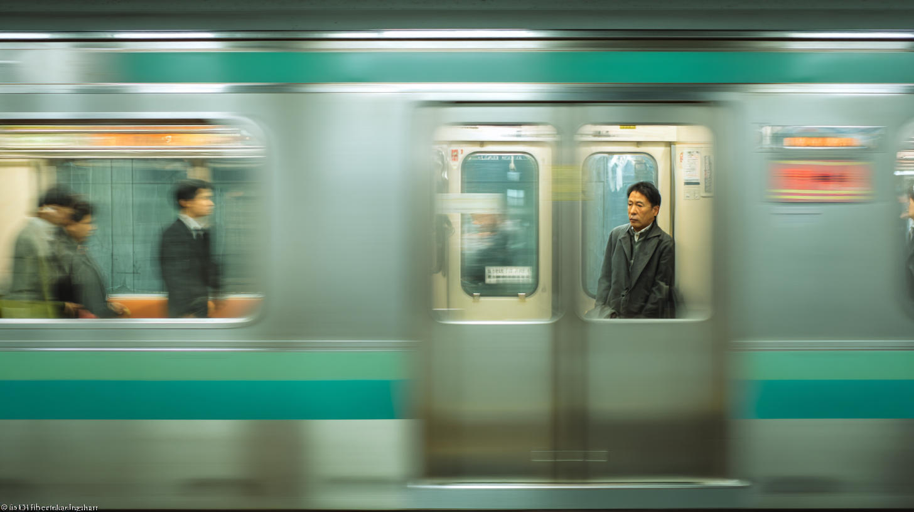

He moves through Tokyo like a shadow. 

Stitched between neon and rain, no one sees him, but he sees everything.

The city doesn't notice, but it carries his pulse. 

In the rumble of its subway alleys, every night he looks up the lights, blurred into constellations of what he could have been.
 

